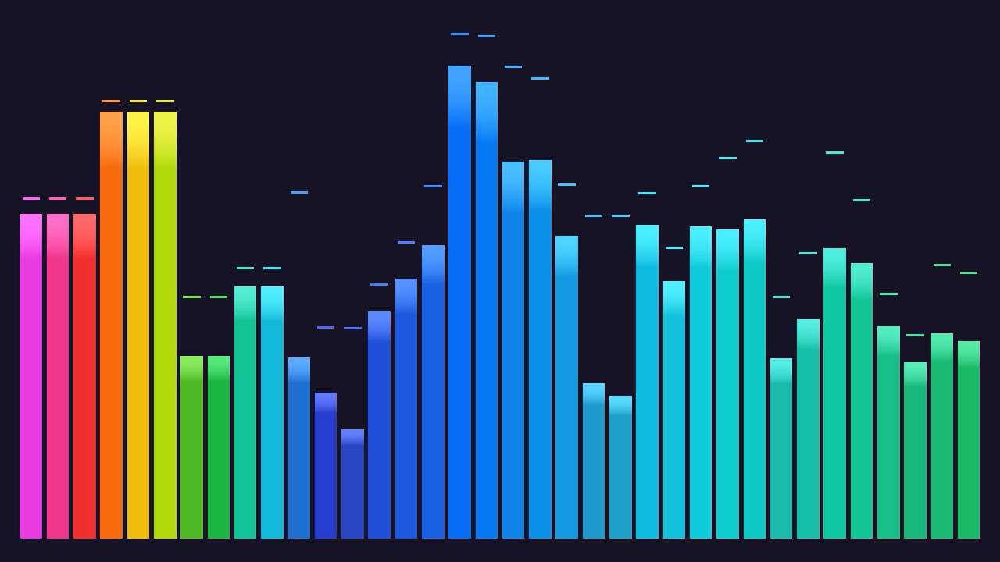

# vibeviz

Audio visualizer that converts audio streams to video with real-time visualization. Supports Icecast, MP3, M4A inputs and outputs to MP4/MKV files or RTMP streams.


**Disclaimer**: Much of this tool was generated using LLMs.




## Features

- Real-time audio spectrum visualization
- Synthwave-style color palette
- Background image support (JPEG/PNG)
- Output to file (MP4/MKV) or RTMP stream
- Smooth animations and peak detection

## TODO

- [ ] Support WAV/FLAC with full speed visuals
- [ ] Easy configuration/customization.
- [ ] Different resolutions.
- [ ] Themes? Color control?
- [ ] Audio passthrough w/o re-encode where possible (possibly happens already with aac? TODO: check)

## Requirements

- FFmpeg libraries
- FFTW3
- libjpeg/libpng (for background images)
- C++17 compiler

## Build

```sh
nix build
```

## Usage

```sh
vibeviz <input_audio> <output_path> [background_image.jpg|.png] [theme]
```

Themes:
- original / synthwave
- nature / launch
- blue / ice

Examples:

```sh
# Local file output
vibeviz input.mp3 output.mp4 background.jpg

# RTMP stream
vibeviz http://icecast.example.com/stream.mp3 rtmp://live.twitch.tv/app/streamkey
```

## License

MIT
